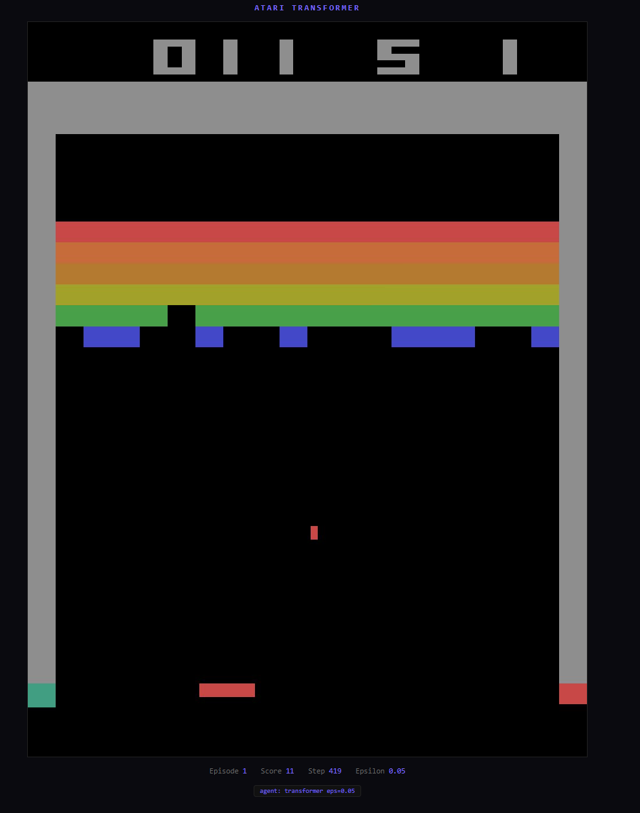
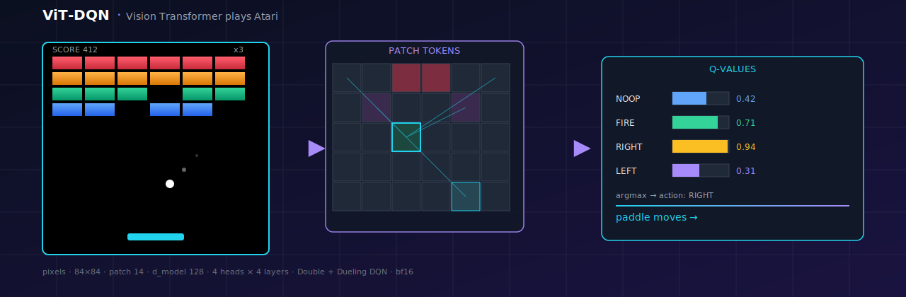
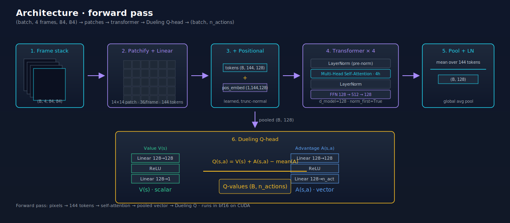
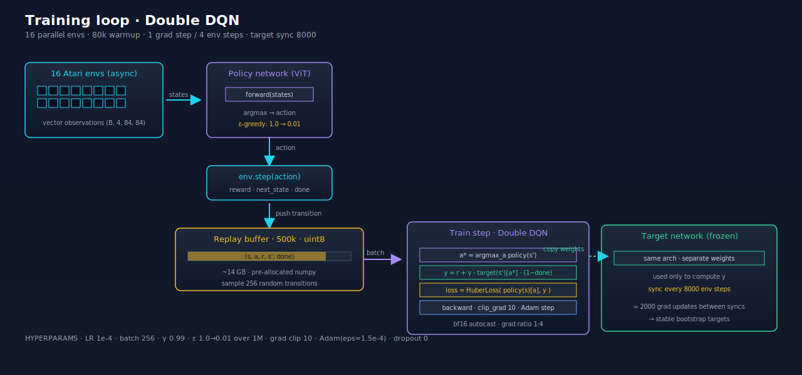
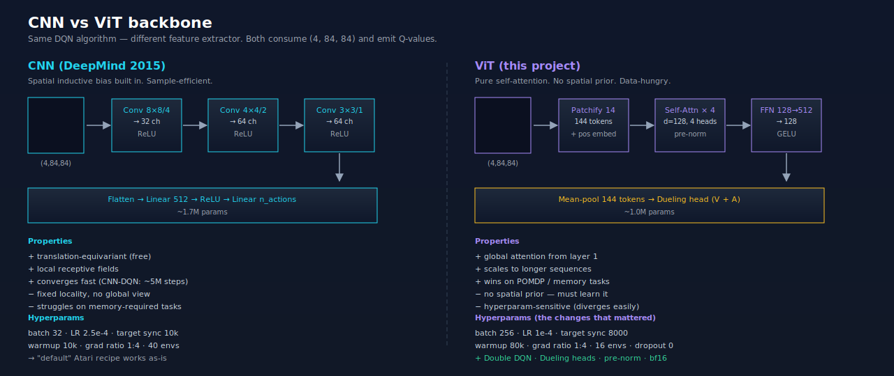

# vit-dqn-atari

<p align="center">
  
</p>

<p align="center">
  
</p>

A Vision Transformer Deep Q-Network agent that learns to play Atari from raw pixels. The standard CNN backbone from the 2015 DeepMind DQN is replaced with a ViT (patchify → transformer encoder → pooled token), wrapped in a Double + Dueling DQN.

This repo contains **two** trainable agents on the same environment so they can be compared apples-to-apples:

| Folder | Backbone | Status |
| --- | --- | --- |
| [`atari_dqn/`](atari_dqn/) | CNN (DeepMind 2015 Nature) | Reference baseline |
| [`atari_dqn_transformet/`](atari_dqn_transformer/) | Vision Transformer | Main contribution |

Both train on `ALE/Breakout-v5` by default and share the same preprocessing (84×84 grayscale, 4-frame stack, frame-skip 4, episodic life loss, fire-on-reset). The only difference is the feature extractor.

---

## Why this exists

Vanilla "swap the CNN for a transformer" diverges. After 30M training steps with naive hyperparameters, the transformer's Q-values were still bouncing and the agent was effectively random. After tuning, **the same architecture learns to play Breakout competently in roughly 2M steps**.

This repo documents *what specifically had to change* to make the transformer trainable on Atari with online DQN. The short version:

- Smaller token count (patch 14 → 144 tokens, not 576)
- Slower target updates (sync every 8000 env steps, not 1000)
- Lower learning rate (1e-4) and longer warmup (80k transitions)
- Dropout off, grad ratio 1, larger batch (256)
- Pre-norm transformer, Double DQN, Dueling heads
- bf16 autocast and uint8 replay for throughput

The full breakdown is below.

---

## Architecture

<p align="center">
  
</p>

Forward pass:

1. **Frame stack** — 4 consecutive 84×84 grayscale frames.
2. **Patchify** — each frame split into 6×6 = 36 non-overlapping 14×14 patches; 4 frames give 144 patches total.
3. **Linear projection** — each patch (49 pixels) projected to a 128-dim token.
4. **Positional embedding** — learned, added to every token so the transformer knows where each patch came from.
5. **Transformer encoder** — 4 layers, 4 heads, pre-norm, dim 128, FFN dim 512.
6. **Mean-pool** the 144 output tokens → single 128-dim state vector.
7. **Dueling head** — separate value V(s) and advantage A(s,a) streams; combine as `Q = V + A − mean(A)`.

Output: `Q-values` of shape `(batch, n_actions)`.

---

## Training pipeline

<p align="center">
  
</p>

- **16 parallel envs** via Gymnasium AsyncVectorEnv (one OS process each)
- **Replay buffer** of 500k transitions, stored as `uint8` (~14 GB) with on-GPU dequant for 4× less PCIe traffic
- **Double DQN target**: `y = r + γ · target_net(s')[ argmax_a policy_net(s')[a] ] · (1 − done)`
- **Loss**: Huber on `(policy_net(s)[a], y)`
- **Optimizer**: Adam, LR 1e-4, eps 1.5e-4, grad clip 10
- **bf16 autocast** on CUDA (rollouts and training)

---

## CNN vs ViT — same algorithm, different backbone

<p align="center">
  
</p>

The CNN baseline is the DeepMind 2015 Nature architecture verbatim. The ViT replaces conv stack with patch tokens + self-attention. Both feed into the same DQN training loop.

| Property | CNN | ViT |
| --- | --- | --- |
| Inductive bias | translation-equivariant, local | none — must learn spatial structure |
| Sample efficiency | high | lower (more steps to reach same score) |
| Hyperparam sensitivity | forgiving | strict — small changes diverge training |
| Global context | only at deepest layer | from layer 1 |
| Best fit | fully observable, short horizon | partial obs, long memory, multi-task |

---

## What changed to make ViT-DQN actually train

The naive setup (transformer + default DQN hyperparams) trained for 30M steps with no learning. These are the changes that flipped it from diverging to converging in ~2M steps.

### Architecture

| Change | Why it matters |
| --- | --- |
| Patch size 14 (was 7) | 576 → 144 tokens. Transformers are data-hungry; fewer tokens = less for self-attention to figure out from scratch. |
| Pre-norm transformer | Post-norm transformers diverge from random init without a learning-rate warmup schedule. Pre-norm is stable. |
| Dueling head (V + A) | Decouples "is this state good?" from "how much does my action matter?" Faster value learning. |
| Double DQN | Policy net picks action, target net evaluates it. Kills systematic Q overestimation that would otherwise compound through bootstrapping. |
| Dropout = 0 | Q-learning bootstraps off own predictions. Dropout adds noise to those predictions → noise compounds across iterations. |

### Hyperparameters

| Knob | Old | New | Reason |
| --- | --- | --- | --- |
| Target sync | 1000 | 8000 | With 16 envs and grad ratio 1:4, only ~8 grad updates between syncs. Targets ran ahead of the policy. New value gives ~2000 updates per sync — within the canonical Rainbow band. |
| Learning rate | 2.5e-4 | 1e-4 | Canonical Adam-DQN value. Higher LR + bf16 caused Q-value blow-ups. |
| Warmup | 10k | 80k | Replay was too uniform-correlated at 10k. cleanrl uses 80k, SB3 uses 100k. |
| Grad steps / train | 2 | 1 | 2 doubled the replay ratio → overfit recent transitions. Mnih / cleanrl / SB3 all use 1. |
| Batch size | 64 | 256 | Transformer kernels need bulk to fill GPU SMs. Lower-variance gradients on top. |
| Replay storage | float32 | uint8 + GPU dequant | 4× less host→device bandwidth, more grad steps per second. |
| AMP | off | bf16 autocast | ~1.6× speedup on Ampere/Ada with no accuracy hit. |

The principle: **a transformer has weaker priors than a CNN, so every source of training noise hurts more.** High LR, dropout, fast-moving targets, and short warmup were each survivable for the CNN but fatal for the ViT.

---

## Project layout

```
vit-dqn-atari/
├── README.md
├── assets/                          ← SVG diagrams used in this README
├── atari_dqn/                       ← CNN baseline (DeepMind 2015)
│   ├── model.py                     ← 3-conv + FC DQN
│   ├── agent.py                     ← Replay + Bellman update
│   ├── env.py                       ← Atari preprocessing + vec env
│   ├── train.py                     ← Training loop
│   ├── play.py                      ← Greedy rollout / viewer
│   └── requirements.txt
└── atari_dqn_transformet/           ← Vision Transformer DQN
    ├── config.py                    ← All hyperparameters in one place
    ├── network.py                   ← Patch embed + transformer + Dueling head
    ├── learner.py                   ← Replay + Double DQN update
    ├── environment.py               ← Atari preprocessing + vec env
    ├── trainer.py                   ← Training loop
    ├── viewer.py                    ← Browser-based live playback
    └── requirements.txt
```

---

## Quick start

Both subprojects are self-contained.

### Train the ViT-DQN agent

```bash
cd atari_dqn_transformer
pip install -r requirements.txt
python trainer.py                   # auto-resumes from checkpoints/latest.pt
python trainer.py --no-resume       # start fresh
python trainer.py --game ALE/Pong-v5
python trainer.py --envs 16
```

Watch the trained agent in the browser:

```bash
python viewer.py
# → http://localhost:5000
```

### Train the CNN baseline

```bash
cd atari_dqn
pip install -r requirements.txt
python train.py
python play.py
```

### Hardware

- **CUDA strongly recommended.** CPU works but is impractically slow.
- Tested on RTX 3080 / 4070-class GPUs with 16 GB system RAM.
- Replay buffer of 500k uint8 transitions ≈ 14 GB RAM.

---

## Results

Training on `ALE/Breakout-v5`, 16 envs, 2M environment steps:

| Backbone | Steps to first non-trivial play | Notes |
| --- | --- | --- |
| CNN baseline | ~1M | Reaches `avg(20) > 50` reliably |
| ViT-DQN (this repo) | ~1.5M | Reaches `avg(20) > 30`, climbing |
| ViT-DQN (naive hyperparams) | did not learn at 30M | Q-values oscillating; agent ≈ random |

Numbers are from this codebase, not paper benchmarks. The point of the comparison is *flipped from "doesn't learn" to "learns"*, not "beats CNN."

---

## Lineage and prior work

The ViT-on-Atari recipe overlaps with several published systems. None of this is novel research; what's here is a clean, reproducible implementation with the hyperparameter recipe documented.

- **Stabilizing Transformers for RL** (Parisotto et al., 2019) — diagnoses why vanilla transformers diverge in RL; proposes GTrXL.
- **Deep Transformer Q-Networks (DTQN)** (Esslinger et al., 2022) — transformer-as-DQN-encoder for POMDPs.
- **Swin-DQN on Atari** (Meng et al., 2022, arXiv:2206.15269) — closest direct comparison: patch transformer + DQN on Atari-57.
- **CoBERL** (Banino et al., 2021) — transformer encoder + contrastive aux loss, beats Rainbow on Atari-57.

Foundational DQN tricks used here:
- DQN — Mnih et al., Nature 2015
- Double DQN — van Hasselt et al., 2015
- Dueling — Wang et al., 2016
- Atari preprocessing — Mnih 2015 / cleanrl / SB3 conventions

---

## License

MIT.
